## OVS实验

### 实验题目

探究 `ovs`网桥链路的搭建速度以及可能影响 `ovs`性能的一些因素

### 实验目的

本实验的目的主要是探究一些可能会影响 `ovs`网桥性能的一些因素，包括 `ovs`的流表规模大小，`ovs`添加的port数量，网桥级联的数量，以及在不同或是相同 `numa`节点下网络吞吐量的变化与上限。同时也探究 `ovs`链路构建的速度，包括 `veth`对的构建速度，`ovs`流表项的添加速度，`ovs`的端口添加速度。

### 实验环境

- 硬件配置：服务器配置为CPU型号64c-128t(Xeon 4th)，内存为512G-16 Channel，使用960GB Optane SSD硬盘。
- 操作系统：Ubuntu 22.04
- 测试工具与使用软件：`iperf` version 2.1.5   、 `ovs_version`: 2.17.9  、 `numactl`

* `Dockerfile`:利用Docker容器的方式帮助你快速搭建实验环境(包括上面的一些测试工具的安装），Dockerfile文件已经给出，也可以利用如下指令快速拉取实验镜像，但是需要注意的是docker容器并不能帮助你模拟两个 `numa`节点的情况，如果想要进行完整的本实验，还是应该使用多个 `numa`节点的服务器。

  ```bash
  docker pull chairandsprite/ovs_lab:v1.3
  ```

### 实验步骤

1. **实验环境准备**

   - 相关软件的安装。在 `linux ubuntu`操作系统下，执行如下指令进行对应工具的安装。(如果你是以 `Dockerfile`构建对应的docker容器可以忽略)

     ```shell
     #实验脚本下载
     git clone https://github.com/zhaodangxue/ovs_lab.git
     #测试工具软件安装
     sudo apt install iperf
     sudo apt install numactl
     sudo apt install openvswitch-switch
     sudo apt install openvswitch-common
     ```
   - 网络拓扑设计，本次实验主要有以下三种网络拓扑，分别用于测试 `ovs`流表规模，`ovs`的port数量对 `ovs`搭建的网络拓扑，以及 `ovs`级联数量对 `ovs`搭建的链路的性能影响

     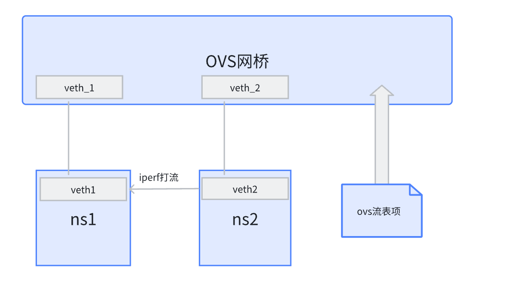

     第一个实验场景是 `ovs`流表规模对 `ovs`搭建链路的网络性能影响，我们在构建的网络命名空间ns1和ns2下各自创建一个 `veth`网卡对，将网卡对的其中一端加入到 `ovs`的端口之中，并且添加对应的两条流表项让 `veth_1`和 `veth_2`之间的流量打通，与此同时，根据我们输入给测试脚本的 `ovs`流表项数量参数来为 `ovs`网桥生成并添加新的 `ovs`流表项，以此来实现对 `ovs`网桥的流表规模大小控制，进一步探究流表规模大小对 `ovs`构建链路性能的影响。

     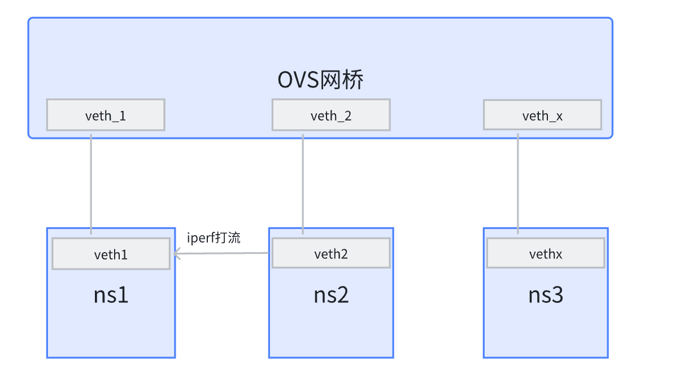

     第二个实验场景是 `ovs`端口(port)数量对 `ovs`搭建链路的网络性能影响，我们在构建的网络命名空间ns1和ns2下各自创建一个 `veth`网卡对，将网卡对的其中一端加入到 `ovs`的端口之中，并且添加对应的两条流表项让 `veth_1`和 `veth_2`之间的流量打通，与此同时，我们在构建的网络命名空间ns3中，根据我们输入给测试脚本的规模参数生成对应数量的 `veth`网卡对，并且将网卡对的一端加入到 `ovs`的端口之中，以此来为 `ovs`网桥生成新的端口(port)，以此来实现对 `ovs`网桥的端口数量控制，进一步探究端口数量对 `ovs`构建链路性能的影响。

     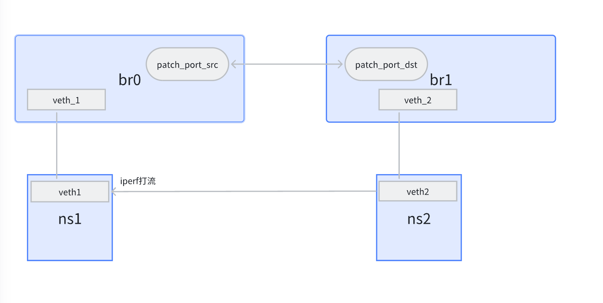

     第三个实验场景是测试 `ovs`网桥级联数量对 `ovs`搭建链路的网络性能影响，我们在构建的网络命名空间ns1和ns2下各自创建一个 `veth`网卡对，将网卡对的其中一端分别加入到 `br0`和 `br1`两个网桥的端口之中，并且创建两个补丁端口 `patch_port_src`和 `patch_port_dst`让两个网桥之间的流量打通，上面的拓扑图只展示了只有两个 `ovs`网桥的级联场景，类似的我们可以在网桥之间通过添加补丁端口 `patch_port_src`和 `patch_port_dst`的方式来构建多个级联网桥的情况，可以通过对我们的测试脚本添加对应参数实现快速部署。

     除此之外，我们还有对 `veth`对创建时间，`ovs`流表项添加时间，`ovs`端口添加时间进行了相应的测试，这里注明我们对于 `veth`对的创建，`ovs`流表项添加，`ovs`端口添加都是以***40***并发线程数量进行创建与添加的。
2. **实验过程**

   测试脚本对于几个场景的测试已经比较的完善了，这里具体解释如何执行对应的脚本得到对应实验类型的具体数据。

   - 步骤1:运行脚本目录下的 `test.sh`即可进行我们对所有要做的实验的实验数据收集。下面是对测试脚本下各个脚本的作用的具体解释。

     - `setup_ovs.sh`:搭建本实验的一个基础环境，主要是一个 `ovs_br0`网桥，三个网络命名空间ns1，ns2，ns3以及veth1,veth2网卡对的创建与配置。
     - `test_ovs_flow.sh`:该脚本接收一个 `-s`参数，代表需要创建并添加的 `ovs`流表项数目，这个脚本主要负责在执行完 `setup_ovs.sh`对 `ovs_br0`网桥的流表规模进行一个控制。
     - `test_ovs_port.sh`:该脚本接收一个 `-s`参数，代表需要创建并添加的 `ovs`端口数目，这个脚本主要负责在执行完 `setup_ovs.sh`对 `ovs_br0`网桥的port规模进行一个控制。
     - `test_ovs_veth.sh`:该脚本接收一个 `-s`参数，代表需要创建并添加的 `veth`网卡对数目，这个脚本负责对 `veth`网卡对的创建。
     - `test_ovs_cascade.sh`:该脚本接收两个参数，第一个是action(有create和cleanup)，第二个是数量(创建的级联 `ovs`网桥数量)，负责对 `ovs`网桥级联实验进行实验环境部署，测试与环境清除。
     - `test_iperf.sh`:该脚本主要是测试常规单线程下veth2和veth1之间的 `iperf`的TCP打流测试，接收两个参数，`-s`代表创建并添加的测试对象规模数量,`-t`代表实验类型，0是流表规模测试，1是端口规模测试，举例：`./test_iperf.sh -s 500 -t 0`代表创建500个流表项后进行常规veth2和veth1之间的 `iperf`的单线程TCP打流测试。
     - `test_iperf_para.sh`:该脚本主要是测试常规多线程下veth2和veth1之间的 `iperf`的TCP打流测试，接收三个参数，`-s`代表创建并添加的测试对象规模数量,`-t`代表实验类型，0是流表规模测试，1是端口规模测试，`-p`代表 `iperf`测试的并发线程数。举例：`./test_iperf_para.sh -s 500 -p 32 -t 0`代表创建500个流表项后进行常规veth2和veth1之间的 `iperf`的32并发线程TCP打流测试。
     - `test_iperf_numa.sh`:该脚本主要是测试在同一 `numa`节点单线程下veth2和veth1之间的 `iperf`的TCP打流测试，接收两个参数，`-s`代表创建并添加的测试对象规模数量,`-t`代表实验类型，0是流表规模测试，1是端口规模测试，举例：`./test_iperf_numa.sh -s 500 -t 0`代表创建500个流表项后进行同一 `numa`节点veth2和veth1之间的 `iperf`的单线程TCP打流测试。
     - `test_iperf_numa_para.sh`:该脚本主要是测试在同一 `numa`节点多线程下veth2和veth1之间的 `iperf`的TCP打流测试，接收三个参数，`-s`代表创建并添加的测试对象规模数量,`-t`代表实验类型，0是流表规模测试，1是端口规模测试，`-p`代表 `iperf`测试的并发线程数，举例：`./test_iperf_numa_para.sh -s 500 -p 32 -t 0`代表创建500个流表项后进行同一 `numa`节点veth2和veth1之间的 `iperf`的32并发线程TCP打流测试。
     - `test_iperf_numa_diff.sh`:该脚本主要是测试在不同 `numa`节点单线程下veth2和veth1之间的 `iperf`的TCP打流测试，接收两个参数，`-s`代表创建并添加的测试对象规模数量,`-t`代表实验类型，0是流表规模测试，1是端口规模测试，举例：`./test_iperf_numa_diff.sh -s 500 -t 0`代表创建500个流表项后进行不同 `numa`节点veth2和veth1之间的 `iperf`的单线程TCP打流测试。
     - `test_iperf_numa_diff_para.sh`:该脚本主要是测试在不同 `numa`节点多线程下veth2和veth1之间的 `iperf`的TCP打流测试，接收三个参数，`-s`代表创建并添加的测试对象规模数量,`-t`代表实验类型，0是流表规模测试，1是端口规模测试，`-p`代表 `iperf`测试的并发线程数，举例：`./test_iperf_numa_diff_para.sh -s 500 -p 32 -t 0`代表创建500个流表项后进行不同 `numa`节点veth2和veth1之间的 `iperf`的32并发线程TCP打流测试。
     - `teardown_ovs.sh`:清除实验环境。

     上面的几个 `sh`脚本是下面几个 `sh`脚本运行的基础，下面的几个 `sh`脚本适合直接输入对应参数进行相应测试。

     - `test_arguement.sh`:这个函数接收三个参数，`-s`代表创建并添加的测试对象规模数量,`-t`代表实验类型，0是流表规模测试，1是端口规模测试，`-p`代表 `iperf`测试的并发线程数。举例：`./test_arguement.sh -s 500 -p 32 -t 0`代表创建500个流表项后进行常规单线程 `iperf`打流，常规多线程 `iperf`打流，不同 `numa`节点单线程 `iperf`打流，不同 `numa`节点多线程 `iperf`打流，相同 `numa`节点单线程 `iperf`打流，相同 `numa`节点多线程 `iperf`打流测试。
     - `test_all_flow.sh`和 `test_all_port.sh`:根据脚本里面事先设定的 `test_num_array`测试规模数组，分别进行对这个数组中每一个元素的对应流表项规模或者端口规模进行一系列 `iperf`打流测试。
     - `test_add_veth.sh`:根据脚本里面事先设定的 `test_num_array`测试规模数组，测试创建添加对应规模大小 `veth`对的时间。
     - `test_cascade.sh`:根据脚本里面事先设定的 `test_num_array`测试规模数组,分别进行对这个数组中每一个元素的 `ovs`网桥级联进行***64***并发线程的 `iperf`打流测试。
     - `test_flow_and_port.sh`:执行 `test_all_flow.sh`和 `test_all_port.sh`两个脚本
     - `test_para.sh`:该测试脚本对常规，同一 `numa`节点,不同 `numa`节点的多线程 `iperf`打流测试从并发线程为1开始到64结束，探究对应 `iperf`打流测试得到的带宽结果。
   - 步骤2:在运行完 `test.sh`脚本后会生成原始数据的data文件夹，我们从其中获取我们所需要的实验数据，其中包括 `iperf`打流测试的结果以及流表项添加，端口添加所需要的时间，下面是对data文件夹下各个文件的解释。

     - `flow_time`文件夹：该文件夹下的xxx.txt文件代表添加xxx条对应 `ovs`流表项所需要的时间。
     - `port_time`文件夹：该文件夹下的xxx.txt文件代表添加xxx条对应 `ovs`端口所需要的时间。
     - `veth_time`文件夹：该文件夹下的xxx.txt文件代表添加xxx条对应 `veth`网卡对所需要的时间。
     - `iperf_result`文件夹：该文件夹下的flow文件夹和port文件夹分别是添加了流表项数量或是端口数量后的 `iperf`打流测试结果，其中里面的每个txt文件的前缀数字代表对应添加的数量，后缀字母代表对应的测试类型(可以参考上面的测试脚本介绍)。cascade文件夹下是对应数量级联 `ovs`网桥的多线程 `iperf`打流测试结果。还有三个 `normal_para.txt`,`numa_diff_para.txt`,`numa_para.txt`,代表三种测试类型在不同并发线程 `iperf`打流测试下得到的结果
3. **数据收集**

   - 需要收集的数据在上面步骤2完成后得到的data文件夹中，根据对应文件夹和文件的名称获取并收集对应实验的数据。这里考虑到 `iperf`测试存在一定的随机性和误差，对于不同流表规模以及不同端口数目的每一种类型 `iperf`打流都重复进行了7次测试并将实验结果记录在对应的文件中。后续我们统计并绘制图表使用的数据是在这7次取到的数据中去掉最小和最大的数据，在剩下的5次数据中取平均值得到。

   graph文件夹中的几个python文件可以用来帮助绘制实验数据的折线统计图，可以根据你得到的data文件夹中的数据去修改这几个python文件中对应的几个数据数组从而来绘制你自己测得的数据统计图。

### 实验结果与数据分析

利用python的matplotlib库我们可以便携地绘制相关数据地折线统计图，绘制图表的相关python函数在脚本文件夹的graph文件夹下。

- 第一组实验数据绘制的图表如下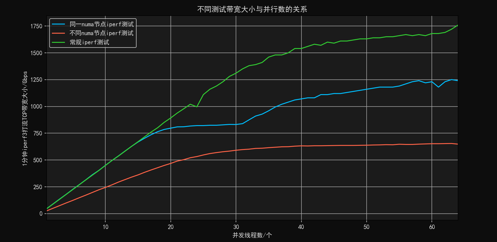

  上面的图表是我们测试三种不同的 `iperf`打流方式与给定 `iperf`打流并发线程数最终绘制出来的一分钟 `iperf`打流带宽的统计图，其中常规 `iperf`测试是没有给 `iperf`测试的server和client绑定确定的 `numa`节点的，同一 `numa`节点测试指的我们将 `iperf`测试的server端和client端都绑定到编号为0的 `numa`节点上，不同 `numa`节点测试指的是我们将 `iperf`测试的server端和client端分别绑定到编号为0，1的两个 `numa`节点上。首先说明我们的实验环境是一台拥有2个 `numa`节点，每个 `numa`节点上有64个 `cpu`。

  - 实验整体得到的结果是符合我们的预期，最终绘制得到的曲线满足

    1. 随着并发线程数的增多，最终带宽满足常规 `iperf`测试大于同一NUMA节点大于不同NUMA节点
    2. 同一NUMA节点和不同NUMA节点的带宽随着并发线程数的增长逐渐缓慢并收敛。
    3. 开始时常规 `iperf`测试和同一NUMA节点测试结果保持基本一致，但是随着并发线程数增多同一NUMA节点的测试会落后并且与常规 `iperf`测试拉开差距。
    4. 32并发线程下的同一NUMA节点的 `iperf`测试结果的两倍约为64并发线程下常规 `iperf`测试的结果。
  - 原因很简单，首先如果 `iperf`测试运行在不同的 NUMA 节点上，可能就需要可能需要跨节点访问内存，这通常会导致更高的延迟和更低的带宽，因为跨节点访问内存的延迟比同节点访问要高，这也就是为什么同一NUMA节点大于不同NUMA节点的原因。同时由于一个 `numa`节点上只有64个 `cpu`，每一个线程的 `iperf`打流测试需要一个 `iperf server`与一个 `iperf client`，需要占用两个 `cpu`，而同一 `numa`节点下 `cpu`只有64个，而常规 `iperf`测试可以使用到两个 `numa`节点的共128个 `cpu`，所以在并发线程数增大后，可以利用的 `cpu`的数量便成为了 `iperf`测试的瓶颈，这也就是为什么最后同一NUMA节点和不同NUMA节点的带宽随着并发线程数的增长逐渐缓慢并收敛，且同一NUMA节点的测试会随着并发线程数增多而与常规 `iperf`测试拉开差距。因为 `cpu`数量的限制，所以在32并发线程下的同一NUMA节点的测试约为64并发线程下常规 `iperf`测试的一半，可以预想的是如果该 `numa`节点有128个 `cpu`，那么64并发线程下最终同一NUMA节点的测试结果一定是大于等于常规 `iperf`测试的结果的。
- 第二组实验数据绘制得到的图表如下：

  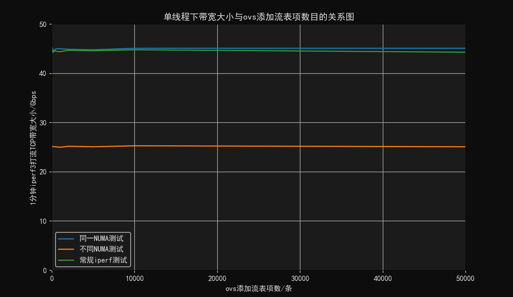

  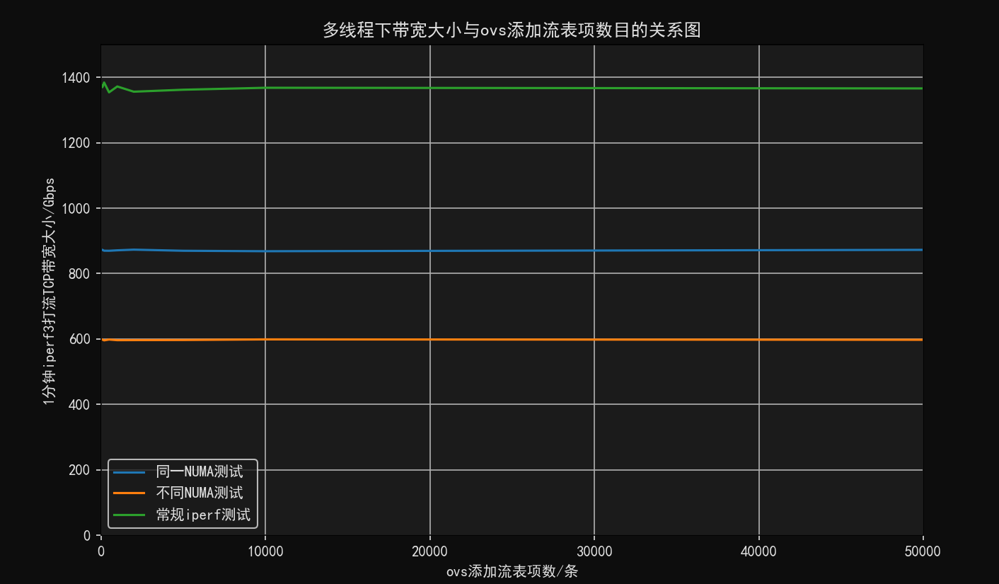

  我们将单线程和多线程下的带宽大小与 `ovs`流表规模的大小绘制对应的关系图，上面的多线程是指在 `iperf`测试中指定并发线程数为32得到的测试结果。

  - 实验整体得到的结果符合我们的预期，满足
    1. 随着流表规模的增大无论是多线程还是单线程，三种不同方式的 `iperf`打流测试获得的带宽大小随着流表规模的不断加大没有出现明显的下降趋势
    2. 单线程下同一NUMA节点的 `iperf`测试与常规 `iperf`测试结果基本没有差别，多线程下同一NUMA节点的 `iperf`测试要明显小于常规 `iperf`测试结果，且无论是哪一种方式，不同NUMA节点的 `iperf`测试都是三种测试类型中最低的。
  - 这个实验整体看下来得出的一个重要结论是，`ovs`的流表规模对最终带宽的影响不大，至少在流表规模(<500000)下来看是这样的，实际应用场景中也是很难出现比500000大很多的情况。在单线程情况下，同一 `numa`节点的 `iperf`测试能够使用的 `cpu`资源是充足的，这不会成为影响它带宽的瓶颈。而多线程情况下对于 `cpu`的使用率是很高的，同一 `numa`节点下只有64个 `cpu`，而常规 `iperf`测试有两个 `numa`节点共128个 `cpu`，`cpu`资源在多线程下会成为 `iperf`测试的瓶颈。不同NUMA节点需要跨节点访问内存，这通常会导致更高的延迟和更低的带宽，因为跨节点访问内存的延迟比同节点访问要高，所以不同NUMA节点的 `iperf`测试都是三种测试类型中最低的。
- 第三组实验数据得到的图表如下：

  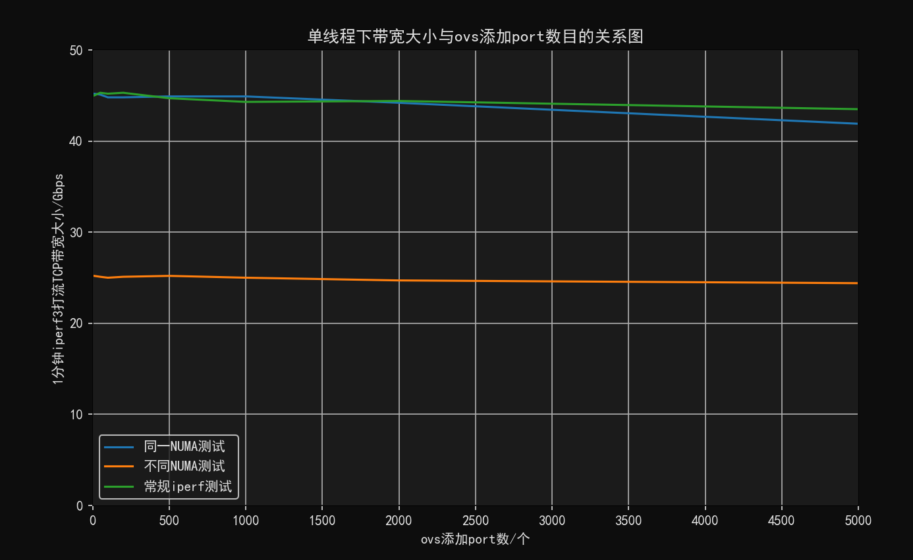

  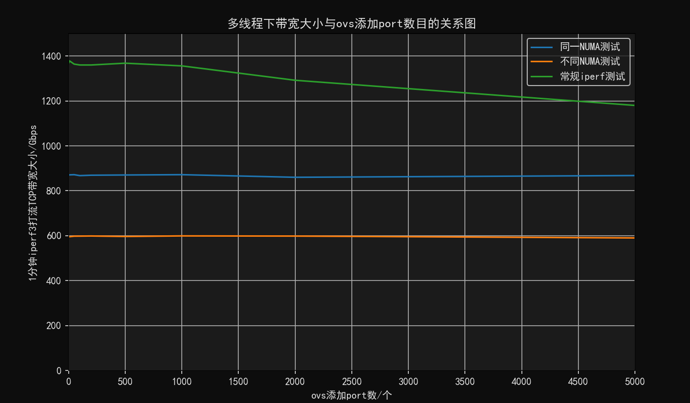

  我们将单线程和多线程下的带宽大小与 `ovs`端口(port)的数量绘制对应的关系图，上面的多线程是指在 `iperf`测试中指定并发线程数为32得到的测试结果。

  - 实验整体得到的结果符合我们的预期，满足
    1. 随着 `ovs`端口(port)的数量的不断增加，可以看到无论是多线程还是单线程下 `iperf`测试所得到的带宽都会出现比较明显的下降。
    2. 单线程下同一NUMA节点的 `iperf`测试与常规 `iperf`测试结果基本没有差别，多线程下同一NUMA节点的 `iperf`测试要明显小于常规 `iperf`测试结果，且无论是哪一种方式，不同NUMA节点的 `iperf`测试都是三种测试类型中最低的。
  - 这个实验得出的一个重要结论是 `ovs`端口(port)的数量多少是会影响 `ovs`搭建的网络链路的性能的，大概在2000个端口数量之后随着端口数量的提升会使带宽出现一个下降的情况，但是实际应用场景中很少会出现一个 `ovs`网桥添加超过2000个端口的情况，在实际应用场景中是比较难以感知到的。其它的结论与第二组实验得出的结论是一致的。
- 第四组实验绘制得到的图表如下：

  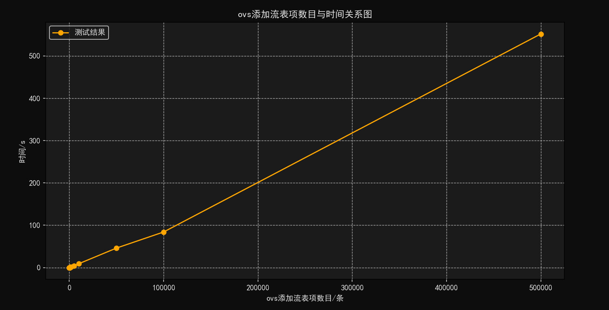

  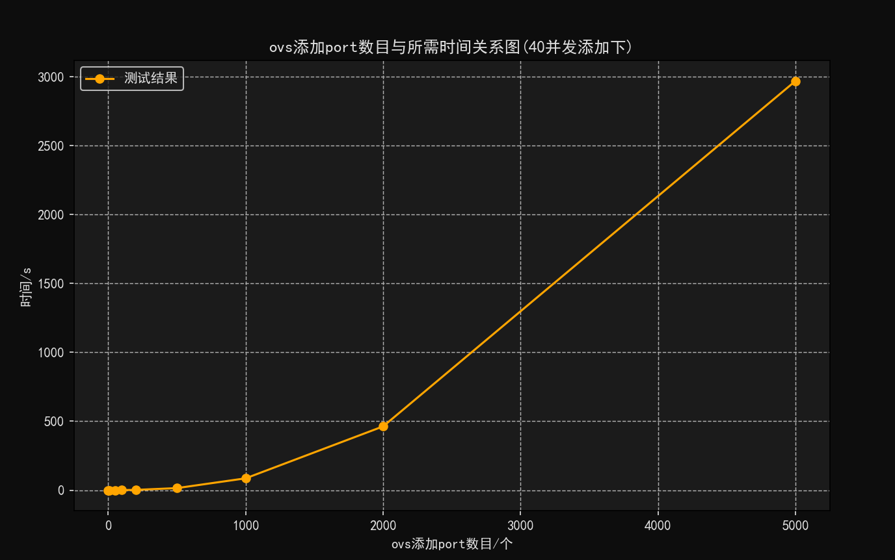

  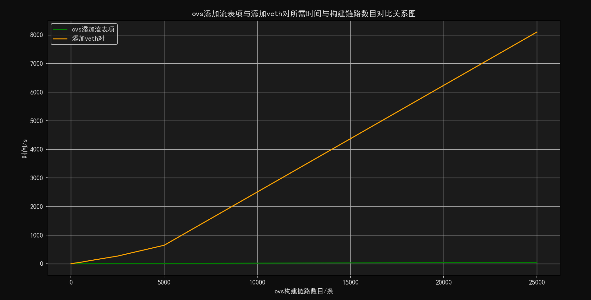

  我们根据添加的 `ovs`流表项数量，`ovs`端口数量，添加 `veth`网卡对的数目与创建添加它们所需要的时间绘制出了它们之间的时间关系图，这里再次注明我们是以***40***并发线程的数量添加它们的。

  - 实验得到的结果如下：

    1. `ovs`添加流表项所需要的时间是最短的，添加500000条流表项也只需要552秒。
    2. `ovs`添加端口(port)的时间开销是很大的，可以看到的是从2000个端口之后它添加端口所增加的时间开销骤增。
    3. 添加 `veth`网卡对的时间在这三者之间居中，但是也能看到添加50000条 `veth`对所需要8098秒，这个时间开销也是很大的。
  - 基于上面的结果，我们绘制了上面三张图中的图三，我们在搭建如下的网络拓扑时。

    

    如果我们要打通两个 `veth`对之间的流量，需要添加两条流表项，就上面的拓扑图而言是 `"in_port=veth_1, actions=output:veth_2"`和 `"in_port=veth_2, actions=output:veth_1"`两条流表规则。所以每搭建一条这样的链路需要两对 `veth`对两条对应的流表项，所以根据这个我们绘制了构建链路数目与添加流表项和添加 `veth`对的时间的对比关系图，对流表项的添加与 `veth`对的创建添加进行了一个横向比较。得出的结论是随着构建链路数目的增加，`veth`对的添加时间会显著大于 `ovs`流表项的添加时间。
- 第五组实验绘制得到的图表如下：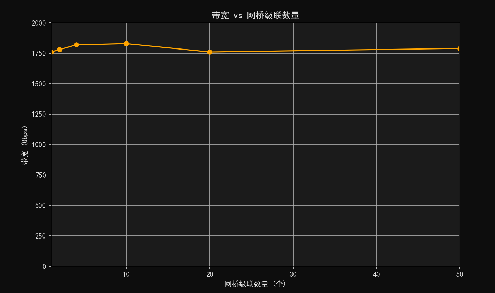

  我们根据创建的级联网桥数量，比较在64多线程常规 `iperf`打流并发下测得的网络带宽与网桥级联数量之间的影响。得出的结论如下：

  - 多个 `ovs`网桥级联对于网络带宽基本没有影响，没有网络性能上的损失。
  - 原因可能是级联的 `ovs`网桥之间的数据传输可能是零拷贝(Zero-Copy)的，数据在传输过程中可能没有多次的内存复制操作。
