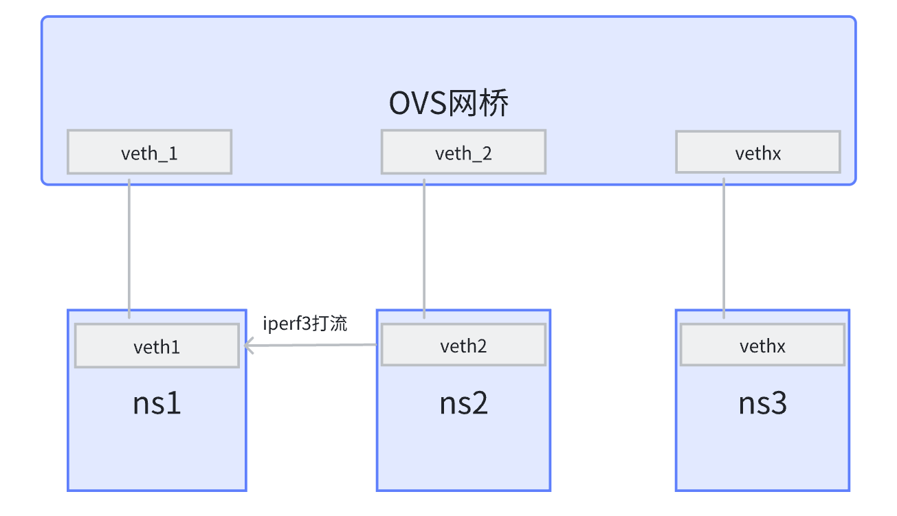

## OVS实验

本实验主要探究ovs的流表项数目对于ovs网桥的网络性能的影响，同时研究不同NUMA节点对于网络性能的影响，并研究传统Linux Bridge的方式和ovs之间的性能对比。本实验中各个文件的作用如下：

* Dockerfile:利用Docker容器的方式帮助你快速搭建实验环境，也可以利用如下指令快速拉取实验镜像

  ```bash
  docker pull chairandsprite/ovs_lab:v1.1
  ```
* setup_bridge.sh:搭建以Linux Bridge的实验环境
* setup_ovs.sh:搭建以ovs的实验环境
* teardown_bridge.sh:清除以Linux Bridge的实验环境
* teardown_ovs.sh:清除以ovs的实验环境
* test_iperf_numa_diff.sh:测试不同numa节点下，iperf3的tcp打流测试与追加的ovs流表项数目的影响,-s参数是追加的流表项数目(也是添加veth对的数目)
* test_iperf_numa.sh:测试在同一numa节点下，iperf3的tcp打流测试与追加的ovs流表项数目的影响,-s参数是追加的流表项数目(也是添加veth对的数目)
* test_ovs.sh:这个脚本用于添加追加的ovs流表项数目，-s是添加追加的流表项数目(也是添加veth对的数目)，这个脚本应当在test_iperf_xx.sh脚本前优先执行，且需要两者的-s参数保持一致，具体测试脚本顺序执行参考test_numa.sh
* test_numa.sh:根据追加流表项数目为0 1 5 10 50 100 200 500 1000 2000 5000的方式执行测试，测试顺序包括配置实验环境，追加流表项数目，测试同一numa节点，不同numa节点以及清除实验环境，直接运行该脚本即可开始测试，需要注意的是docker容器并不能模拟numa节点的情况，所以更合理的测试环境是使用一个有至少两个numa节点的服务器，参照Dockerfile安装对应工具再运行本脚本进行测试

实验具体网络拓扑：



简单来说就是创建三个网络命名空间其中ns1和ns2中各有一对veth对网卡，一端在ovs网桥中，另一端在自身的netns中，通过向ovs追加veth_1到veth_2互相之间的流表项，可以实现veth1和veth2之间的互联，并通过iperf3的tcp打流方式进行测试，ns3负责添加不断添加新的vethx(x为整型)网卡对，并在ovs网桥中配置veth_x到veth_1的流表项来实现对ovs网桥的流表项添加。
